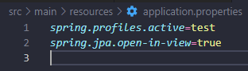
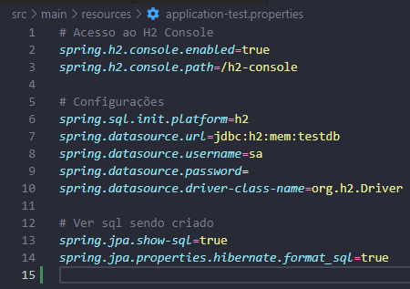
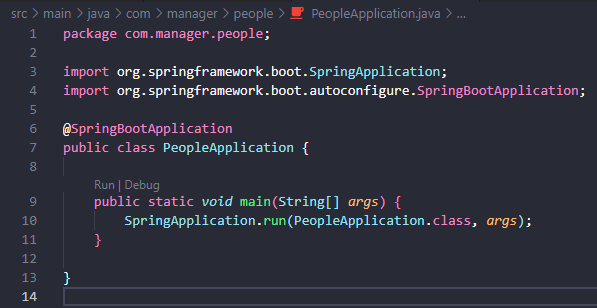
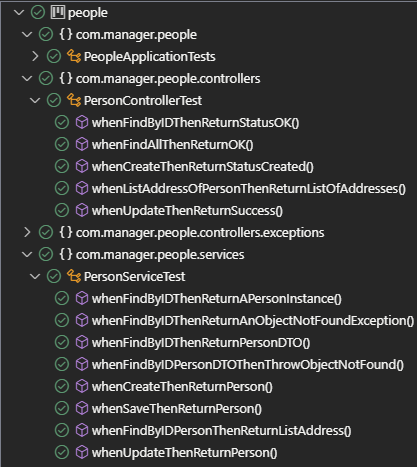

# Manager People Api

## Descrição do Projeto

Projeto consiste na criação de uma api para gerenciamento de pessoas, onde teremos as funcionalidades:

- Criar uma pessoa
- Editar uma pessoa
- Consultar uma pessoa
- Listar pessoas
- Criar endereço para pessoa
- Listar endereços da pessoa
- Poder informar qual endereço é o principal da pessoa  

Este projeto foi feita na participação da avaliação técnica da empresa [Attornatus](https://www.attornatus.com.br/).

## End-Points do Projeto

### Para Pessoa

- [GET] consultar 1 pessoa especifica, passar id por parametro na requisição: {url}/person/{id}

- [GET] Listar todas as pessoas: {url}/person

- [POST] criar pessoa: {url}/person/create
``` Json Body
{
    "name": "type string",
    "birthDate": "type string"
}
```
- [GET] Listar endereços de uma pessoa: {url}/person/address/{personId}

- [GET] Listar endereço principal de uma pessoa: {url}/person/address/principal/{personId}

- [POST] Adicionar mais um endereço a uma pessoa: {url}/address/create
``` Json Body
{
    "street": "type string",
    "cep": "type string",
    "numberAddress": "type Integer",
    "city": "type string",
    "principalAddress": "type boolean",
    "personId": "type long",
}
```


## Descrição da Api
- Observação: Não foi feito deploy do projeto como proposto, pois as ferramentas que encontrei são pagas.
### Executar Api localmente:
- Para clonar o projeto: git clone https://github.com/TaylanTorres09/menage-people-api.git
- Para Executar o projeto precisasse:
    - Java [JDK](https://www.oracle.com/java/technologies/downloads/#java17). Este projeto está usando a versão 17.
    - Para perfil de Teste, Banco [H2](https://www.h2database.com/html/main.html) utilizado em memória, coloquei neste pois é um banco de fácil configuração e utilização.

- Extensões do vscode utilizadas:
    - [Debugger for Java](https://marketplace.visualstudio.com/items?itemName=redhat.java)
    - [Spring Boot Extension Pack](https://marketplace.visualstudio.com/items?itemName=Pivotal.vscode-boot-dev-pack)

- Para seleção do perfil **test**.



- Configuração do banco de dados de Teste.



- Na pasta src/main, execute o arquivo PeopleApplication.java



- Também foi implementados testes unitários utilizando o [Mockito](https://site.mockito.org/)



- Para testar a api você pode utilizar ferramentas de client como:
    - [Postman](https://www.postman.com/)
    - [Insomnia](https://insomnia.rest/download)
    - Extensão do VsCode [Thunder Client](https://marketplace.visualstudio.com/items?itemName=rangav.vscode-thunder-client)
    - Ou outra de sua preferência.

## Próximos Passos
- Fazer interfaces no front-end.
## Autor
<a href="https://www.linkedin.com/in/taylan-torres" target="_blank"></a> 
